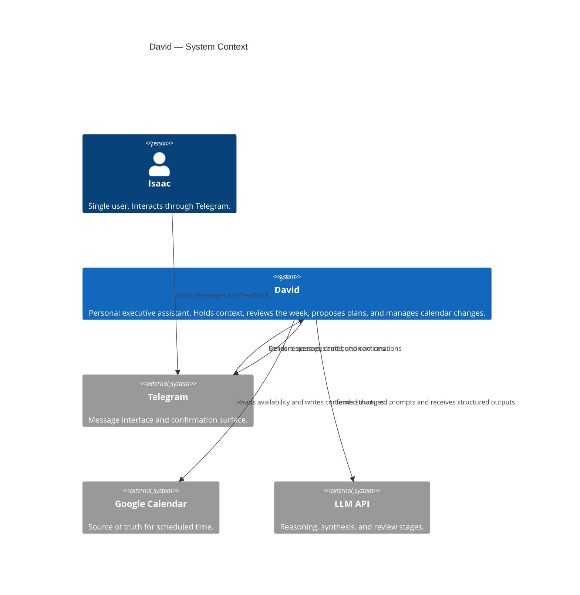
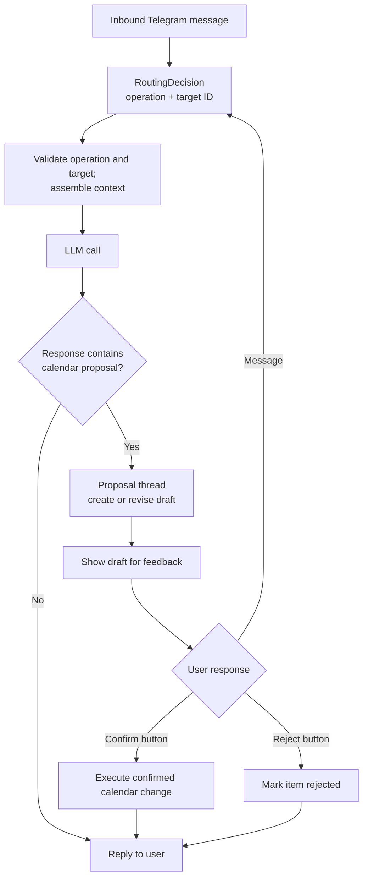
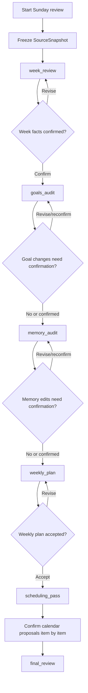
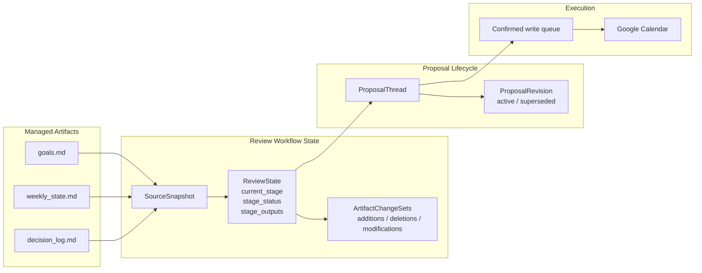

# David — Architecture

Companion to [DESIGN_DOC.md](./DESIGN_DOC.md). End-state runtime architecture only.

## 1. System Context

David sits between Isaac and three external systems:
- Telegram for interaction
- Google Calendar for read/write scheduling
- an LLM API for reasoning and synthesis

## 2. Normal Interaction Flow

Normal conversation selects an operation before touching pending work.

- The router selects `discuss`, `create_draft`, `revise_draft`, or `clarify`, plus a draft ID when applicable.
- Application state limits available operations and targets; revisions recheck the target before dispatch.
- If the model selects `revise_draft` with no editable pending work, code maps it to `clarify` with a null target. Other invalid selections still fail validation.
- Discussion uses a response schema without calendar proposal fields and preserves pending drafts.
- The answering model receives the full compact context, including calendar end times and pending work.
- Calendar proposals enter a revision-aware proposal thread.
- Only a confirmed proposal is executed against Google Calendar.

`handle_message()` is the sole classification entry point for incoming text,
including when pending state is empty. It validates and dispatches the decision.
`process_message()` requires that decision and state; it only assembles context,
generates a response, and records the conversational turn. Revision handlers pass
their already-selected operation through the same response-generation path.

### Context Profiles

David uses four context profiles:
- `lean`
- `calendar_context`
- `priority_strategy`
- `full`

Ordinary turns use `full`: operation labels alone do not indicate which context
an answer needs. Calendar reads use the existing session cache. Weekly-review
snapshots include both past and upcoming events with their start and end times.

Routing uses a short production prompt and the full current-session transcript.
`reasoning/model_client.py` sends Gemini directly to Google's API and Luna through
OpenRouter. Model selection lives in `config.py`; benchmark
endpoint pins, price caps, and datasets are separate from runtime policy.
Discussion requires no separate pause/resume state. Interrupted review recovery
and artifact retries retain their existing explicit buttons.

`observability/context_usage.py` records provider token usage and model capacity
without entering conversational history. A ContextVar attributes nested calls,
including worker-thread calls, to the active session. Synthesis restores that scope
in its background job. Finalization logs and persists the summary to `session_usage`
before clearing history; `/context` displays current or last-session measurements.
Missing counts remain unknown, and cumulative token totals are separate from peak
per-request occupancy. Published model limits are centralized in `config.py`.

Calendar context includes event start and end times. New weekly-review snapshots
freeze both past and upcoming seven-day event windows for later scheduling stages.

`observability/context_usage.py` measures provider-reported usage for chat, review,
and synthesis. A ContextVar carries the active session through worker-thread calls;
the synthesis job pins that scope to its queued session ID and usage bucket. An old
job cannot consume a newer session's measurements or clear its history and cache.
Per-request logs contain counts
and model capacity, while session completion logs and saves aggregate usage to
SQLite's `session_usage` table before clearing history. `/context` displays the
current or last completed session without calling a model. Published model limits
live in `config.py`; unknown limits and missing provider counts stay unknown.
The latest request is retained even outside a chat session, so `/context` can show
a standalone weekly review's measurements separately from older session totals.

The system also runs two scheduled routines:
- daily check-in, which reuses the normal interaction flow with scheduled initiation
- Sunday review, which uses the staged workflow below

## 3. Sunday Review Workflow

Sunday review is a durable, gated workflow. Each model call is narrow and
checkpointed, and user confirmation is required before downstream stages depend
on uncertain facts or user-impacting artifacts.

It runs as a staged pipeline:
1. `week_review`
2. factual confirmation
3. `goals_audit`
4. conditional goals confirmation
5. `memory_audit`
6. conditional memory confirmation
7. `weekly_plan`
8. weekly-plan confirmation
9. `scheduling_pass`
10. calendar proposal confirmation
11. `final_review`

Each stage consumes:
- the frozen `SourceSnapshot`
- committed outputs from earlier stages
- active proposal and revision state when relevant

### Sunday Review Guarantees

- Later stages must respect constraints learned earlier in the review.
- Review progress is persisted after each stage.
- A restart resumes the active stage rather than restarting the workflow.
- Review proposals remain revision-aware through feedback loops.

## 4. Persistent State Model

The architecture uses four kinds of durable state:
- markdown artifacts
- a frozen review snapshot
- compact workflow state
- proposal threads and revisions

### Source Snapshot

Each review freezes one `SourceSnapshot` containing:
- `goals.md`
- `weekly_state.md`
- `decision_log.md`
- past-week calendar data
- upcoming calendar context when needed

The snapshot is stored once per workflow and reused by all stages.

### ReviewState

`ReviewState` is the source of truth for review recovery. It stores:
- workflow status
- current stage
- stage status
- source snapshot reference
- compact stage outputs
- artifact change sets
- active proposal threads

Chat history may support the workflow, but it is never the authoritative state.

### Stage Outputs

Each stage writes a compact structured result, typically:
- `summary`
- `key_findings`
- `constraints`
- `carry_forward`
- final artifact text when that stage directly produces one

These outputs are concise and behavior-driving. They are not transcript dumps.

### Artifact Change Sets

Managed markdown files are updated through semantic change sets rather than raw line diffs.

Each change set records:
- additions
- deletions
- modifications
- a short summary

Full markdown is the final rendered artifact, not the only stored form.

## 5. Proposal Lifecycle

Calendar work uses proposal threads with revisions.

Thread states:
- `draft`
- `in_revision`
- `ready_for_confirmation`
- `confirmed`
- `rejected`
- `executed`

Revision states:
- `active`
- `superseded`

Rules:
- `superseded` applies to an older revision that was replaced.
- `rejected` applies to the thread as a whole.
- calendar `cancel` remains an event action, not a proposal lifecycle state.
- only confirmed proposals enter the execution queue.

## 6. Recovery And Restart Behavior

Review workflows are durable and resumable.

The system guarantees:
- stale-session cleanup does not discard active reviews
- each stage has a commit boundary
- stage outputs are persisted before advancing the workflow
- the system resumes from the exact active stage and interaction state
- important progress is never stored only in chat history

Normal ad hoc conversations may be lightweight. Sunday review is not.
