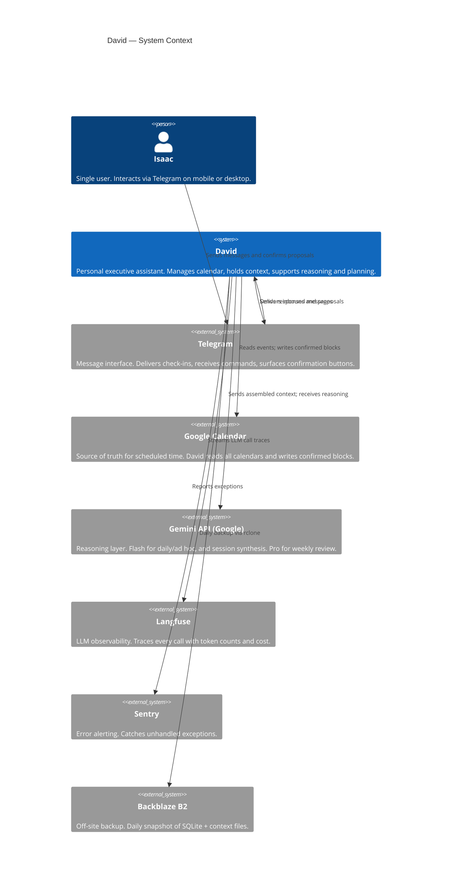
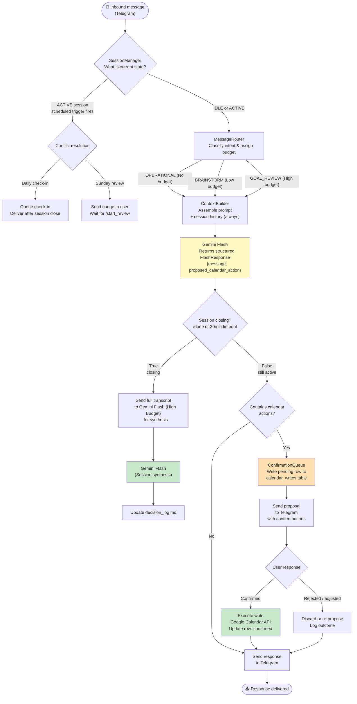
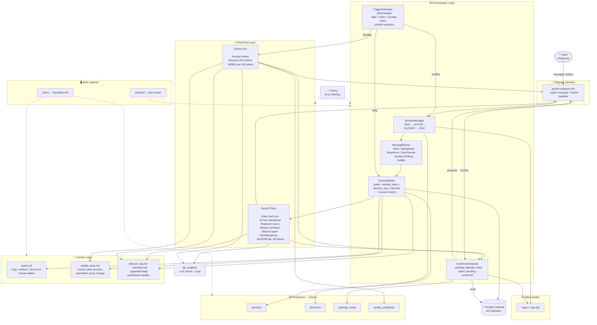

# David — Architecture

*Companion to the design document. Three diagrams at increasing levels of detail.*

---

## 1. System Context

The highest-level view. David sits between Isaac and three external systems: Telegram (interface), Google Calendar (integration), and the Gemini API (reasoning). Everything else is internal.

---

## 2. Reasoning & Message Data Flow

How a message moves through the system from receipt to response, using thinking budget routing.

### Key invariants

Every calendar write passes through `ConfirmationQueue` — there is no path from a model response to a Google Calendar write that bypasses user confirmation.

Flash always returns a typed `FlashResponse` object. The `MessageRouter` assigns a thinking budget based on intent classification (`OPERATIONAL`, `BRAINSTORM`, `GOAL_REVIEW`) via keyword heuristics. Because an operational query can seamlessly evolve into a brainstorm, chat history is maintained and injected into the context for all modes. This simplifies the architecture by keeping all ad hoc reasoning on a single model while scaling compute dynamically.

Session synthesis always goes to Pro regardless of whether the session was escalated mid-way.

---

## 3. Detailed Component Flowchart

Full internal architecture showing all components, data stores, and external services.

