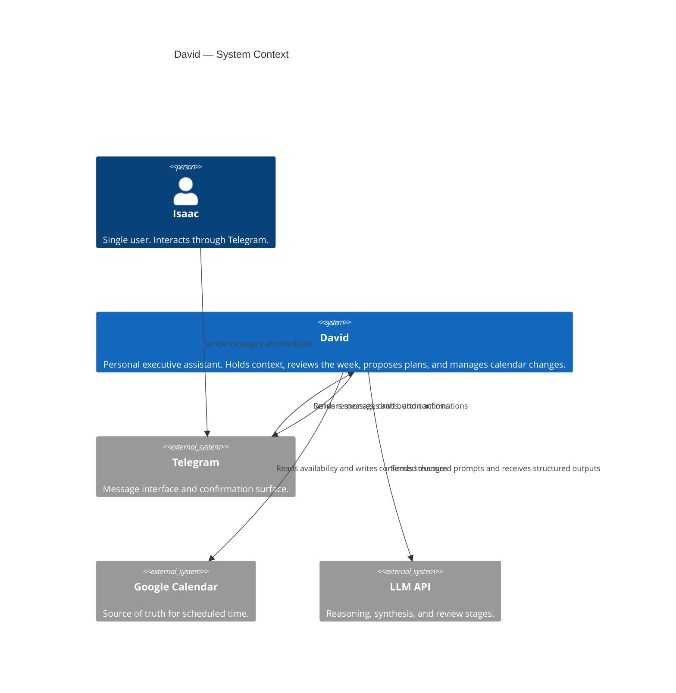
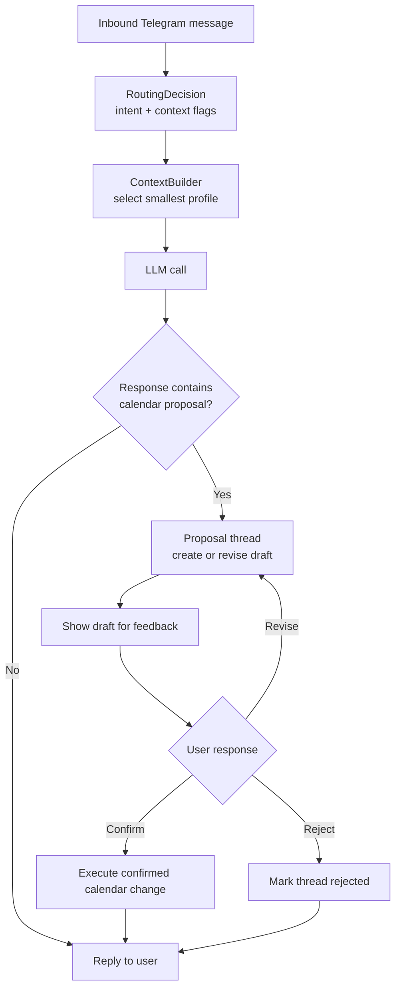
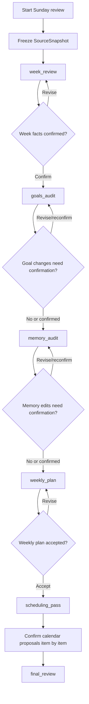
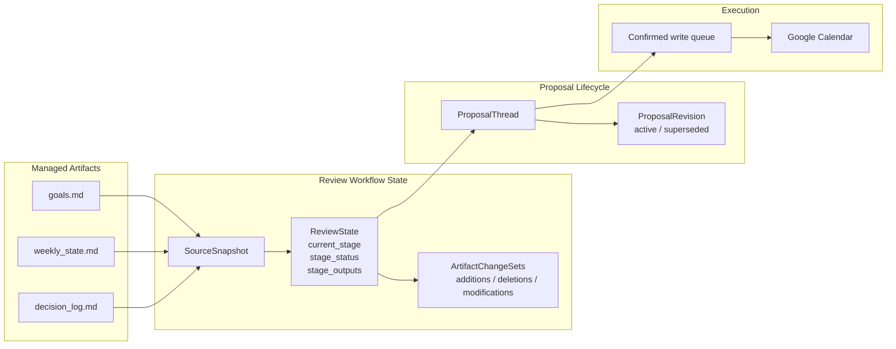

# David — Architecture

Companion to [DESIGN_DOC.md](./DESIGN_DOC.md). End-state runtime architecture only.

## 1. System Context

David sits between Isaac and three external systems:
- Telegram for interaction
- Google Calendar for read/write scheduling
- an LLM API for reasoning and synthesis

## 2. Normal Interaction Flow

Normal conversation stays lightweight and selective.

- The router classifies each turn as `operational` or `strategic`.
- The router also detects whether the turn needs calendar context, strategy context, or both.
- The context builder selects the smallest valid context profile.
- Calendar proposals enter a revision-aware proposal thread.
- Only a confirmed proposal is executed against Google Calendar.

### Context Profiles

David uses four context profiles:
- `lean`
- `calendar_context`
- `priority_strategy`
- `full`

The router chooses the smallest profile that can answer the turn correctly.

The system also runs two scheduled routines:
- daily check-in, which reuses the normal interaction flow with scheduled initiation
- Sunday review, which uses the staged workflow below

## 3. Sunday Review Workflow

Sunday review is a durable, gated workflow. Each model call is narrow and
checkpointed, and user confirmation is required before downstream stages depend
on uncertain facts or user-impacting artifacts.

It runs as a staged pipeline:
1. `week_review`
2. factual confirmation
3. `goals_audit`
4. conditional goals confirmation
5. `memory_audit`
6. conditional memory confirmation
7. `weekly_plan`
8. weekly-plan confirmation
9. `scheduling_pass`
10. calendar proposal confirmation
11. `final_review`

Each stage consumes:
- the frozen `SourceSnapshot`
- committed outputs from earlier stages
- active proposal and revision state when relevant

### Sunday Review Guarantees

- Later stages must respect constraints learned earlier in the review.
- Review progress is persisted after each stage.
- A restart resumes the active stage rather than restarting the workflow.
- Review proposals remain revision-aware through feedback loops.

## 4. Persistent State Model

The architecture uses four kinds of durable state:
- markdown artifacts
- a frozen review snapshot
- compact workflow state
- proposal threads and revisions

### Source Snapshot

Each review freezes one `SourceSnapshot` containing:
- `goals.md`
- `weekly_state.md`
- `decision_log.md`
- past-week calendar data
- upcoming calendar context when needed

The snapshot is stored once per workflow and reused by all stages.

### ReviewState

`ReviewState` is the source of truth for review recovery. It stores:
- workflow status
- current stage
- stage status
- source snapshot reference
- compact stage outputs
- artifact change sets
- active proposal threads

Chat history may support the workflow, but it is never the authoritative state.

### Stage Outputs

Each stage writes a compact structured result, typically:
- `summary`
- `key_findings`
- `constraints`
- `carry_forward`
- final artifact text when that stage directly produces one

These outputs are concise and behavior-driving. They are not transcript dumps.

### Artifact Change Sets

Managed markdown files are updated through semantic change sets rather than raw line diffs.

Each change set records:
- additions
- deletions
- modifications
- a short summary

Full markdown is the final rendered artifact, not the only stored form.

## 5. Proposal Lifecycle

Calendar work uses proposal threads with revisions.

Thread states:
- `draft`
- `in_revision`
- `ready_for_confirmation`
- `confirmed`
- `rejected`
- `executed`

Revision states:
- `active`
- `superseded`

Rules:
- `superseded` applies to an older revision that was replaced.
- `rejected` applies to the thread as a whole.
- calendar `cancel` remains an event action, not a proposal lifecycle state.
- only confirmed proposals enter the execution queue.

## 6. Recovery And Restart Behavior

Review workflows are durable and resumable.

The system guarantees:
- stale-session cleanup does not discard active reviews
- each stage has a commit boundary
- stage outputs are persisted before advancing the workflow
- the system resumes from the exact active stage and interaction state
- important progress is never stored only in chat history

Normal ad hoc conversations may be lightweight. Sunday review is not.
