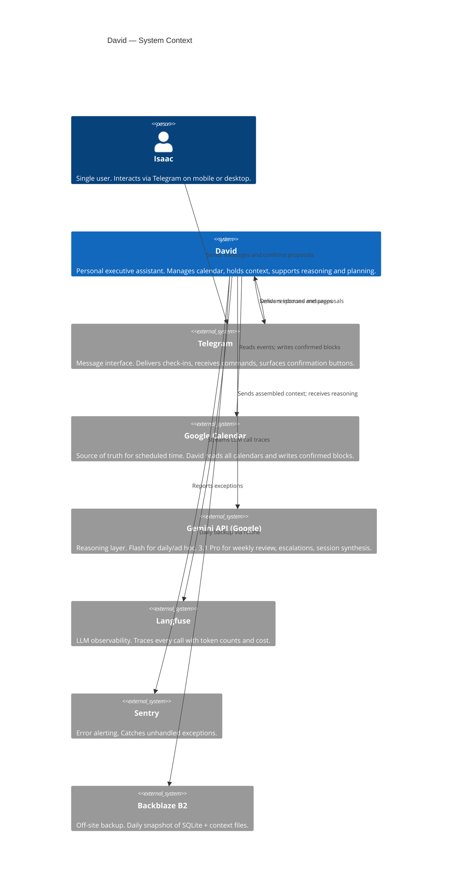
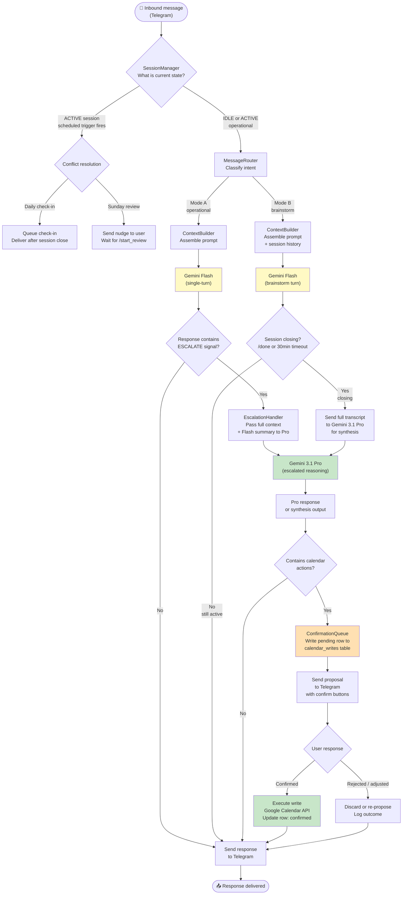
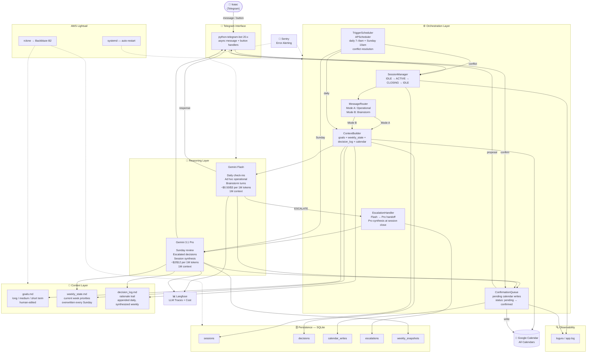

# David — Architecture

*Companion to the design document. Three diagrams at increasing levels of detail.*

---

## 1. System Context

The highest level view. David sits between Isaac and three external systems: Telegram (interface), Google Calendar (integration), and the Gemini API (reasoning). Everything else is internal.

---

## 2. Reasoning & Escalation Data Flow

How a message moves through the system from receipt to response, and when Flash hands off to Pro.

### Key invariants

Every calendar write passes through `ConfirmationQueue` — there is no path from a model response to a Google Calendar write that bypasses user confirmation. The `[[ESCALATE: reason]]` signal is emitted by Flash as plain text at the end of its response; the orchestrator checks for it with a simple string match. Session synthesis always goes to Pro regardless of whether the session was escalated mid-way.

---

## 3. Detailed Component Flowchart

Full internal architecture showing all components, data stores, and external services.

